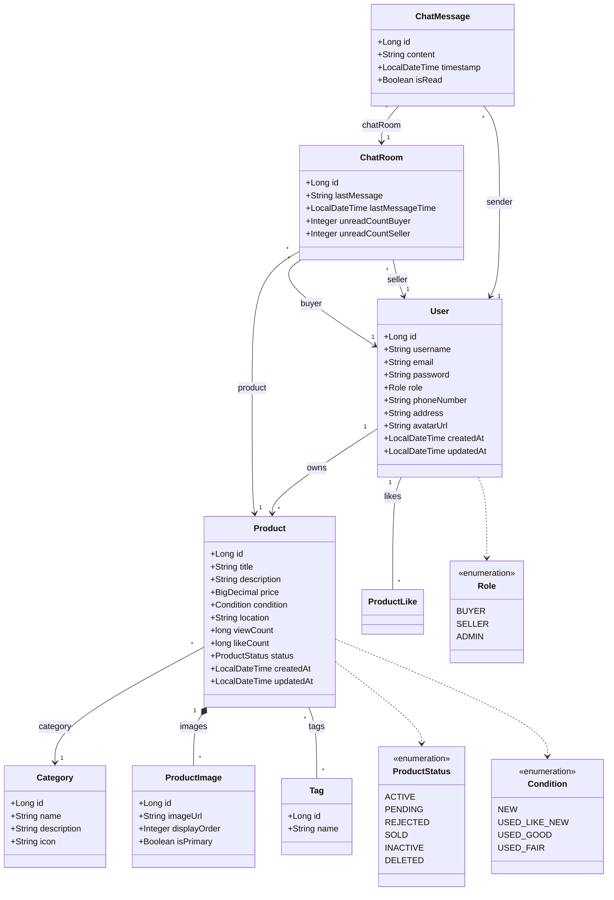

# Oudekeniss Marketplace - Class Diagram

This document illustrates the domain model and relationships for the Oudekeniss marketplace application.

```mermaid
classDiagram
    %% Enumerations
    class Role {
        <<enumeration>>
        BUYER
        SELLER
        ADMIN
    }

    class ProductStatus {
        <<enumeration>>
        ACTIVE
        PENDING
        REJECTED
        SOLD
        INACTIVE
        DELETED
    }

    class Condition {
        <<enumeration>>
        NEW
        USED_LIKE_NEW
        USED_GOOD
        USED_FAIR
    }

    %% Domain Entities
    class User {
        +Long id
        +String username
        +String email
        +String password
        +Role role
        +String phoneNumber
        +String address
        +String avatarUrl
        +LocalDateTime createdAt
        +LocalDateTime updatedAt
    }

    class Product {
        +Long id
        +String title
        +String description
        +BigDecimal price
        +Condition condition
        +String location
        +long viewCount
        +long likeCount
        +ProductStatus status
        +LocalDateTime createdAt
        +LocalDateTime updatedAt
    }

    class Category {
        +Long id
        +String name
        +String description
        +String icon
    }

    class ProductImage {
        +Long id
        +String imageUrl
        +Integer displayOrder
        +Boolean isPrimary
    }

    class ChatRoom {
        +Long id
        +String lastMessage
        +LocalDateTime lastMessageTime
        +Integer unreadCountBuyer
        +Integer unreadCountSeller
    }

    class ChatMessage {
        +Long id
        +String content
        +LocalDateTime timestamp
        +Boolean isRead
    }

    class Tag {
        +Long id
        +String name
    }

    %% Relationships
    User "1" --> "*" Product : owns
    Product "*" --> "1" Category : category
    Product "1" *-- "*" ProductImage : images
    Product "*" -- "*" Tag : tags
    User "1" -- "*" ProductLike : likes
    
    %% Chat Relationships
    ChatRoom "*" --> "1" Product : product
    ChatRoom "*" --> "1" User : buyer
    ChatRoom "*" --> "1" User : seller
    ChatMessage "*" --> "1" ChatRoom : chatRoom
    ChatMessage "*" --> "1" User : sender

    %% Enum Associations
    User ..> Role
    Product ..> ProductStatus
    Product ..> Condition
```
